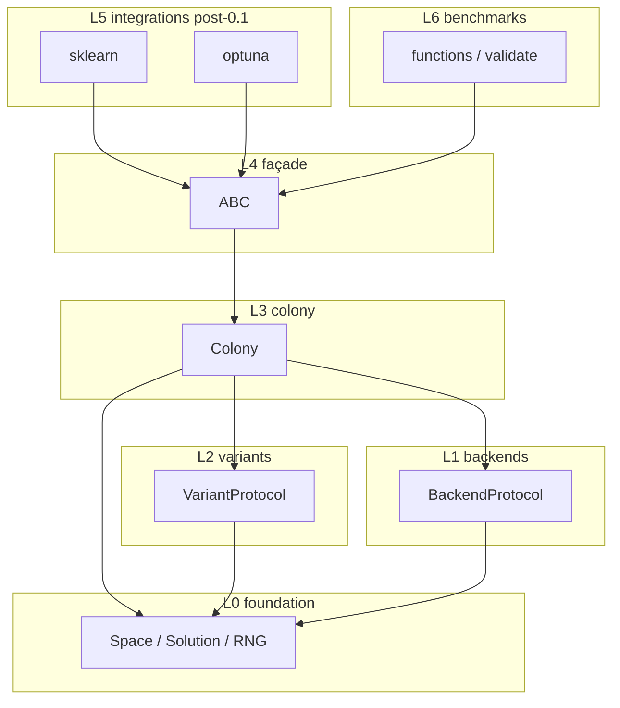

# Swarm Seek: A literature-validated Artificial Bee Colony library for Python

**Design Document — v0.1 (Draft)**  
**Date:** 2026-07-26  
**Status:** Approved 2026-07-26 (novelty PROCEED; open questions Q1–Q7 resolved)  
**Target first release:** `0.1.0` (production-stable beta)

---

## 1. Summary

**Swarm Seek** (`swarm-seek` on PyPI; import name `swarm_seek`) is an open-source Python package that implements Derviş Karaboga’s Artificial Bee Colony (ABC) algorithm and its principal peer-reviewed continuous variants (GABC, qABC, MABC), with a batched NumPy execution core, an ask/tell optimization loop, and automated regression tests against published benchmark figures.

Version `0.1.0` ships the continuous-space core: Original ABC plus GABC, qABC, and MABC; `ContinuousSpace`; NumPy backend; literature-backed validation tests; Sphinx documentation; and CI matching the packaging rigor of mature sibling scientific packages. Combinatorial spaces (CABC), optional Numba/JAX backends, and scikit-learn / Optuna adapters are designed as post-`0.1.0` extensions of the same architecture, not as redesigns.

**License:** Apache-2.0.

---

## 2. Motivation and problem statement

### 2.1 Current landscape

ABC is a widely cited swarm metaheuristic for continuous (and later combinatorial) optimization. Practitioners who want ABC in Python today typically choose among:

1. A minimal or unmaintained single-variant solver (e.g. BeeColPy, Hive, honeybee).
2. A large general metaheuristics library that ships only the original ABC formulation alongside dozens of unrelated algorithms (e.g. MEALPY’s `OriginalABC`).
3. A domain-narrowed wrapper (hyperparameter tuner, TSP hardcode, or single ML model trainer).

None of these combine (a) a citation-linked family of the variants the literature actually uses, (b) a vectorized / batched performance layer, (c) an ask/tell contract compatible with modern black-box workflows, and (d) automated checks that implementations reproduce published convergence behavior within a documented tolerance.

### 2.2 Why now

Ask/tell interfaces are now standard in Nevergrad, pymoo, and Optuna. Hyperparameter search and expensive simulation loops expect the user to own evaluation parallelism. At the same time, the ABC literature has long moved past the 2005/2007 baseline (Gbest-guided, quick, and modified ABC are common citation targets), yet the Python packaging ecosystem has not. Swarm Seek targets that gap: variant fidelity, engineering, and validation — not novelty of the underlying algorithm (public since Karaboga’s 2005 technical report).

### 2.3 Non-goals

Swarm Seek will **not**:

1. Become a general metaheuristics suite (no PSO, DE, GA, etc.).
2. Ship multi-objective / Pareto MOABC in `0.1.0` (deferred).
3. Ship Best-So-Far ABC, Chaotic ABC, or other secondary variants in `0.1.0` (deferred pending demand and citation verification).
4. Claim bit-identical reproduction of every published table when papers omit seeds, RNG streams, or floating-point details — validation uses documented tolerance bands and recorded parameter assumptions.
5. Require Numba, JAX, scikit-learn, or Optuna as hard runtime dependencies.
6. Replace dedicated hyperparameter frameworks; adapters compose with them rather than reimplementing study orchestration.

---

## 3. What's genuinely new

Honest differentiation after landscape review (not “first ABC in Python”). **Core novelty** is (1)–(2); (3)–(5) are product and engineering choices that make the core usable and maintainable, not vacant niches by themselves.

1. **Variant family as first-class modules** — Original, GABC, qABC, and MABC as swappable strategies with primary-source citations on the implemented equations. Independent scan (2026-07-26): MEALPY, NiaPy, BeeColPy, BeeOptimal, and colonyx ship original/single-lineage ABC only — none offer this published-variant set as a maintained, tested family.
2. **Literature-oracle regression tests** — automated checks that mean/best (or paper-defined) statistics on standard functions fall within documented tolerance of published figures. **Hard `0.1.0` bar (Q3 = b):** Original ABC vs Karaboga & Akay (2009), **and** ≥1 introducing-paper table oracle each for GABC, qABC, and MABC (Zhu & Kwong 2010; Akay & Karaboga 2012; Karaboga & Gorkemli 2014). Marketing and README must lead with variants + validation, not “yet another ABC.”
3. **Orthogonal architecture** — search space, variant strategy, and execution backend as separate plug-in axes so new variants do not touch backends and new backends do not rewrite variant math (ABC-specific design; not claimed as unique in the wider optimizer ecosystem).
4. **Ask/tell as the primary integration surface** — adoption choice aligned with Nevergrad / pymoo / Optuna idioms so users own evaluation parallelism. Ask/tell itself is not novel; pairing it with a citation-linked ABC variant family is the product differentiator.
5. **Production packaging from day one** — quality bar (`src/` layout, typed API, Sphinx + Furo, ≥90% coverage, ruff + pre-commit, GitHub Actions, CONTRIBUTING / CHANGELOG / CITATION.cff), patterned on KoopmanGraph’s docs and CI discipline. Packaging rigor is expected for a production-stable beta; it is not the scientific gap.

---

## 4. Goals

Numbered goals for `0.1.0`. Each maps to a verifiable outcome.

| ID | Goal | Verification |
|----|------|--------------|
| G1 | Implement Original ABC with equation-level citation to Karaboga (2005) / Karaboga & Basturk (2007). | Unit tests of update steps; docstring locators; literature notebook or fixture. |
| G2 | Implement GABC, qABC, and MABC as separate strategy modules with primary citations. | Per-variant unit tests + literature regression fixtures. |
| G3 | Provide `ContinuousSpace` with box bounds and dimension validation. | Property/unit tests on clip, sample, and shape contracts. |
| G4 | Expose a stable ask/tell colony engine (`ask` → evaluate → `tell`) with seeded RNG. | Determinism tests; API contract tests. |
| G5 | Ship a default NumPy batched backend for candidate generation / population arrays. | Backend unit tests; no pure-Python per-bee hot path in the default path. |
| G6 | Literature oracles in CI: Original vs Karaboga & Akay (2009); GABC, qABC, and MABC each with ≥1 introducing-paper table oracle (Q3 = b). | CI-gated regression tests for all four variants. |
| G7 | Achieve ≥90% line coverage on `src/swarm_seek` before tagging `0.1.0`. | `pytest-cov` `fail_under = 90`. |
| G8 | Ship Sphinx docs (install, quickstart, API, architecture, limitations) and Read the Docs config. | Docs build job in CI. |
| G9 | Ship Apache-2.0 licensing, CITATION.cff, CONTRIBUTING, CHANGELOG, SECURITY, issue/PR templates. | Repo audit checklist. |
| G10 | Publish `0.1.0` to PyPI as Development Status :: 4 - Beta with a reproducible install path. | Tag-triggered release workflow; clean `pip install swarm-seek`. |

Post-`0.1.0` goals (designed for, not required at launch): G11 Numba backend; G12 JAX backend; G13 `ABCSearchCV`; G14 `ABCSampler`; G15 `PermutationSpace` + CABC; G16 binary/mixed spaces.

---

## 5. Target users and use cases

| User | Use case |
|------|----------|
| Optimization / OR researcher | Reproduce or extend continuous ABC experiments; swap Original / GABC / qABC / MABC under one API; cite equation modules against papers. |
| ML practitioner | Black-box hyperparameter or architecture search via ask/tell (and later `ABCSearchCV` / `ABCSampler`) without leaving familiar Python tooling. |
| Scientific software engineer | Embed a seeded, tested ABC loop inside a larger simulation or experiment pipeline with custom evaluation (HPC, async, batched). |

**Top three `0.1.0` use cases**

1. Minimize a continuous objective on box bounds with GABC (or Original) via ask/tell.
2. Run seeded multi-trial benchmark studies on Sphere / Rastrigin / Rosenbrock / Griewank / Ackley matching literature setups.
3. Compare variants under identical space, population size, and RNG policy for a research notebook.

---

## 6. Related work

| Project | What it does | Status | Gap this package fills |
|---------|--------------|--------|------------------------|
| [MEALPY](https://github.com/MEALPY-Ecosystem/mealpy) | Large metaheuristic library; `ABC.OriginalABC` only | Active | No GABC/qABC/MABC family; no ABC literature-oracle CI; not ABC-first. |
| [NiaPy](https://github.com/NiaOrg/NiaPy) | Nature-inspired framework; `ArtificialBeeColonyAlgorithm` (2007 cite) | Active (~279★) | Single original ABC; breadth of algos, not a validated ABC variant family. |
| [BeeColPy](https://pypi.org/project/beecolpy/) | Continuous + binary/angle-modulated ABC | Stable on PyPI; last release ~2021 | Single-variant lineage; no published-number regression suite. |
| [BeeOptimal](https://pypi.org/project/beeoptimal/) | Dedicated ABC package with docs | PyPI 2024; early | Original ABC only; no variant family / literature oracles / ask-tell-first design. |
| [colonyx](https://pypi.org/project/colonyx/) | Rust-backed multi-swarm toolkit incl. ABC | Active early | Multi-algo performance toolkit; not citation-linked ABC variants + oracles. |
| [swarmlib](https://pypi.org/project/swarmlib/) | Viz-oriented swarm algos; ABC with Lévy flights | Niche | Educational / visual; Lévy-flight ABC diverges from Karaboga equation fidelity focus. |
| [Hive](https://github.com/rwuilbercq/Hive) | Educational ABC reference | Unmaintained | Explicitly not performance-oriented. |
| [ECabc](https://github.com/ECRL/ECabc) | ABC framed as hyperparameter tuner (JOSS) | Maintained niche | Narrow tuner API; not a general variant + space + backend library. |
| [Nevergrad](https://github.com/facebookresearch/nevergrad) / [pymoo](https://pymoo.org/) | Ask/tell black-box optimizers (many algorithms) | Active | Ask/tell pattern exists here; no dedicated ABC variant family + literature oracles. |
| Academic GABC / qABC / MABC / MOABC repos | Paper-tied experiment scripts | Research-only | Not packaged, tested, or maintained as general-purpose software. |

**Build vs. contribute (novelty review):** Contributing GABC/qABC/MABC upstream to MEALPY or NiaPy would add variants inside broad multi-algorithm frameworks but would not deliver Swarm Seek’s literature-oracle CI, ABC-first ask/tell product, or focused adoption path. **Decision: build** `swarm-seek`; keep upstream contribution as optional later mirroring, not a substitute.

**Relationship to ECabc:** ECabc remains a valid, focused tuner. Swarm Seek is a different product: general ABC optimization library with variant modules, space/backend separation, and literature validation. Hyperparameter tuning is a use case (via ask/tell now; sklearn/Optuna later), not the sole framing.

**Naming note:** ECabc also exports a top-level class named `ABC`. Swarm Seek’s `from swarm_seek import ABC` is a different package and import path. Docs and FAQ should disambiguate (`swarm_seek.ABC` vs `ecabc.ABC`) so users and citation text do not confuse the two.

---

## 7. Architecture overview

Architecture is **custom to ABC** (space × variant × backend), while packaging/docs/CI follow KoopmanGraph-level rigor. Folder layout must not redefine the API contract: public façade vs power-user modules vs private helpers (leading `_`).

### 7.1 Layer diagram

```text
L5  integrations/     (post-0.1.0: sklearn, optuna)     — imports L4, L3
L4  façade            ABC, solve helpers                  — imports L3, L2, L1, L0
L3  colony            Colony engine, ask/tell, state      — imports L2, L1, L0
L2  variants          Original, GABC, qABC, MABC (+CABC later) — imports L0 only
L1  backends          NumPy (default); Numba/JAX later    — imports L0 only
L0  foundation        Space, Solution, RNG, types, errors — no upward imports
L6  benchmarks        Test functions + literature oracles — imports public API / L0–L4
```

**Dependency rule:** each layer imports only from the same layer or lower. Variants must not import backends or colony. Backends must not import variants. Integrations must not reach into private `_` helpers of variants. Cycles are forbidden.



### 7.2 Orthogonal plug-in axes

| Axis | Responsibility | `0.1.0` implementations |
|------|----------------|-------------------------|
| Space | Representation, bounds, sampling, repair | `ContinuousSpace` |
| Variant | Employed / onlooker / scout update equations | `original`, `gabc`, `qabc`, `mabc` |
| Backend | Array ops / optional JIT / optional accelerator | `numpy` |

Adding a variant is a new L2 module + tests + literature fixture. Adding a backend is a new L1 module implementing `BackendProtocol`. Neither change requires editing the other axis.

---

## 8. Core data model and public API

### 8.1 Types (sketches)

```python
from __future__ import annotations

from dataclasses import dataclass
from typing import Literal, Protocol, runtime_checkable

import numpy as np
from numpy.typing import NDArray

FloatArray = NDArray[np.floating]

VariantName = Literal["original", "gabc", "qabc", "mabc"]
BackendName = Literal["numpy", "auto"]  # "numba" | "jax" post-0.1.0


@dataclass(frozen=True, slots=True)
class Solution:
    """A single candidate in the search space."""

    x: FloatArray  # shape (n_dim,)
    fitness: float


@dataclass(frozen=True, slots=True)
class ColonyState:
    """Immutable snapshot of population state (for logging / tests)."""

    population: FloatArray  # (pop_size, n_dim)
    fitness: FloatArray     # (pop_size,)
    trials: NDArray[np.integer]
    best: Solution
    n_ask: int
    n_tell: int
    rng_state: object       # opaque, backend-agnostic serialization TBD


@runtime_checkable
class Space(Protocol):
    n_dim: int

    def sample(self, n: int, rng: np.random.Generator) -> FloatArray: ...
    def repair(self, x: FloatArray) -> FloatArray: ...
    def validate(self, x: FloatArray) -> None: ...


@runtime_checkable
class VariantStrategy(Protocol):
    """Published update rules for employed / onlooker / scout phases."""

    name: str
    citation: str  # short bibliographic key; full cite in module docstring

    def employed_step(
        self,
        population: FloatArray,
        fitness: FloatArray,
        rng: np.random.Generator,
        *,
        backend: BackendProtocol,
        space: Space,
        params: dict[str, float | int],
    ) -> FloatArray: ...

    def onlooker_step(
        self,
        population: FloatArray,
        fitness: FloatArray,
        rng: np.random.Generator,
        *,
        backend: BackendProtocol,
        space: Space,
        params: dict[str, float | int],
    ) -> FloatArray: ...

    def scout_step(
        self,
        population: FloatArray,
        fitness: FloatArray,
        trials: NDArray[np.integer],
        rng: np.random.Generator,
        *,
        backend: BackendProtocol,
        space: Space,
        params: dict[str, float | int],
    ) -> tuple[FloatArray, NDArray[np.integer]]: ...


@runtime_checkable
class BackendProtocol(Protocol):
    name: str

    def generate_candidates(
        self,
        population: FloatArray,
        partner_indices: NDArray[np.integer],
        phi: FloatArray,
        *,
        space: Space,
    ) -> FloatArray: ...
```

**Validation rules**

- `ContinuousSpace(bounds)`: `bounds` length = `n_dim`; each `(lo, hi)` with `lo < hi`; finite floats.
- Fitness: `sense: Literal["minimize", "maximize"] = "minimize"` on `ABC` / `Colony` (Q1 = b). Maximization compares accordingly (no silent negation).
- Bound repair: **clip** to box for continuous spaces (Q2 = a). Document and override only if a specific paper requires another policy.
- `ask` returns only candidates that need evaluation this step (Q5 = c); `tell` length and order must match that batch; mismatch raises a typed error. Phase accounting (employed / onlooker / scout) is documented for power users.
- Convergence: `max_evals`, `max_iters`, and optional fitness-stall criteria (Q4 = b). Pluggable `Termination` protocol is post-`0.1.0` if needed.
- RNG: `numpy.random.Generator` only (no global `RandomState`); seed accepted at colony construction.

### 8.2 Public façade sketch

```python
from swarm_seek import ABC, ContinuousSpace

space = ContinuousSpace(bounds=[(-5.12, 5.12)] * 30)
colony = ABC(
    variant="gabc",
    space=space,
    pop_size=40,
    limit=100,          # scout abandonment limit
    sense="minimize",
    max_evals=10_000,
    max_iters=None,
    stall_evals=None,   # optional fitness-stall window
    seed=0,
    backend="numpy",
)

while not colony.converged:
    candidates = colony.ask()                 # only unevaluated candidates (Q5 = c)
    fitnesses = objective(candidates)         # user-owned; may be vectorized
    colony.tell(fitnesses)

print(colony.best.x, colony.best.fitness)
```

Convenience (optional, non-exclusive with ask/tell):

```python
result = colony.minimize(objective, max_evals=10_000)
```

`minimize` is sugar that loops ask/tell internally; ask/tell remains the supported integration surface.

### 8.3 Root `__all__` (proposed for `0.1.0`)

Stable root exports (thin façade) — Q6 = c:

- `ABC`
- `ContinuousSpace`
- `Solution`
- `__version__`

Power-user (documented, not necessarily in root `__all__`):

- `swarm_seek.variants.*`
- `swarm_seek.backends.numpy`
- `swarm_seek.benchmarks.*`
- `swarm_seek.colony.Colony`

Docs/FAQ disambiguate `swarm_seek.ABC` from `ecabc.ABC`.

---

## 9. Module design

Layout uses `src/swarm_seek/`. Names below are design intent; exact file splits may refine during implementation without changing layer rules.

### 9.1 `swarm_seek.space` (L0)

**Purpose:** search-space representations.  
**`0.1.0`:** `ContinuousSpace`.  
**Later:** `PermutationSpace`, `BinarySpace`, `MixedSpace`.  
**Extension:** implement `Space` protocol; provide `sample` / `repair` / `validate`.

### 9.2 `swarm_seek.types` / `swarm_seek.errors` (L0)

**Purpose:** `Solution`, shared array aliases, typed exceptions (`TellShapeError`, `BoundsError`, `UnknownVariantError`).

### 9.3 `swarm_seek.backends` (L1)

**Purpose:** numerical kernels for candidate generation and related array ops.  
**`0.1.0`:** `numpy` (+ `auto` → numpy).  
**Later:** `numba`, `jax` as optional extras.  
**Rule:** backends never encode variant-specific equations beyond shared arithmetic primitives used by strategies.

### 9.4 `swarm_seek.variants` (L2)

| Module | Algorithm | Primary sources |
|--------|-----------|-----------------|
| `original` | Original ABC | Karaboga (2005); Karaboga & Basturk (2007) |
| `gabc` | Gbest-guided ABC | Zhu & Kwong (2010) |
| `qabc` | Quick ABC | Karaboga & Gorkemli (2014) |
| `mabc` | Modified ABC | Akay & Karaboga (2012) |
| `cabc` | Combinatorial ABC | Karaboga & Gorkemli (2011) — **post-`0.1.0`** |

Each module documents: paper citation, equation identifiers as implemented, parameter names mapped to paper symbols, and known ambiguities (see §14).

### 9.5 `swarm_seek.colony` (L3)

**Purpose:** population state, trial counters, phase orchestration, ask/tell batching, convergence predicates (`max_evals`, `max_iters`, optional fitness stall).  
**Key type:** `Colony` (engine). `ABC` (L4) is a thin constructor around `Colony` + variant registry.

### 9.6 `swarm_seek` façade (L4)

**Purpose:** ergonomic constructors and registry lookup (`variant="gabc"` → strategy instance). Keeps tutorials on one import path.

### 9.7 `swarm_seek.integrations` (L5, post-`0.1.0`)

- `sklearn.py` — `ABCSearchCV`
- `optuna_sampler.py` — `ABCSampler`  
Both wrap ask/tell; no duplicate ABC math.

### 9.8 `swarm_seek.benchmarks` (L6)

- `functions.py` — Sphere, Rastrigin, Rosenbrock, Griewank, Ackley with formulations matching the validation papers (explicit citation per function).
- `oracles.py` / `validate.py` — tabulated literature targets, tolerances, and runner helpers used by tests.
- Not a substitute for user objectives; shipped for validation and tutorials.

---

## 10. Dependencies and ecosystem integration

### 10.1 Runtime (hard)

| Dependency | Role |
|------------|------|
| `numpy` | Population arrays, RNG (`Generator`), default backend |

No other hard deps for `0.1.0`.

### 10.2 Optional extras

| Extra | Packages | When |
|-------|----------|------|
| `dev` | pytest, pytest-cov, ruff, pre-commit, nbmake, … | Contributors |
| `docs` | sphinx, furo, sphinx-copybutton | Docs builds |
| `numba` | numba | Post-`0.1.0` backend |
| `jax` | jax | Post-`0.1.0` backend |
| `sklearn` | scikit-learn | Post-`0.1.0` `ABCSearchCV` |
| `optuna` | optuna | Post-`0.1.0` `ABCSampler` |

### 10.3 Ecosystem adapters (post-`0.1.0`)

- **scikit-learn:** `ABCSearchCV` mirrors `RandomizedSearchCV` / search-CV patterns; evaluation remains user/sklearn-owned.
- **Optuna:** `ABCSampler` implements Optuna’s sampler interface; study lifecycle stays in Optuna.
- **Ask/tell:** primary integration path for custom loops (aligned with Nevergrad / pymoo / Optuna ask-tell idioms).

---

## 11. Validation strategy

### 11.1 Unit tests

- Space bounds, repair, sampling shapes.
- Variant equation pieces (employed neighbor selection, φ scaling, gbest term in GABC, qABC onlooker neighborhood, MABC modification rate / scaling) with small hand-checked fixtures.
- Colony ask/tell contract, seed determinism, abandonment/scout triggers.
- Backend candidate generation vs a slow reference implementation for tiny populations.

**Coverage floor:** 90% line coverage on `swarm_seek` (`fail_under = 90`), matching KoopmanGraph’s gate.

### 11.2 Integration tests

- End-to-end minimize on Sphere (low dimension) reaches near-zero fitness within budget.
- Multi-variant parity harness: same seed policy and space; each variant runs without error and improves from initial mean fitness.

### 11.3 Literature regression fixtures

| Variant | Primary oracle source | `0.1.0` requirement (Q3 = b) |
|---------|----------------------|------------------------------|
| Original | Karaboga & Akay (2009), *Appl. Math. Comput.* 214(1) | **Required** — ≥1 CI-gated table oracle (Sphere / Rastrigin / Rosenbrock / Griewank / Ackley subset as extractable). |
| GABC | Zhu & Kwong (2010) | **Required** — ≥1 introducing-paper table oracle. |
| qABC | Karaboga & Gorkemli (2014) | **Required** — ≥1 introducing-paper table oracle. |
| MABC | Akay & Karaboga (2012) | **Required** — ≥1 introducing-paper table oracle. |

**Policy**

- Store expected mean/best (or paper-defined statistic) with dimension, bounds, colony size, limit, evaluation budget, and run count.
- Assert within a **tolerance band**, not exact float equality; document assumptions where papers omit seeds or RNG details.
- Do **not** claim bit-identical reproduction of published tables when seeds/RNG are unspecified.
- Shipping `0.1.0` without a paper-table oracle for any of the four variants is a release blocker (not a silent gap).
- CI runs a **fast smoke** every PR (reduced ``max_evals``, ``n_runs=1``, still
  asserting each fixture’s published ``abs_tol``); `@pytest.mark.slow` covers
  full paper FE budgets and multi-run suites (release / schedule).

Follow-up workflows during implementation (not design blockers): literature algorithm review, benchmark suite scaffolding, and table→fixture extraction for each oracle.

### 11.4 Notebooks (`examples/`)

| Notebook | Objective | Pass criteria |
|----------|-----------|---------------|
| `01_ask_tell_sphere.ipynb` | Ask/tell on Sphere | Best fitness below fixed threshold; seeded. |
| `04_custom_objective.ipynb` | User-defined fitness + ask/tell | Seeded ask/tell best below threshold. |
| `05_system_integration.ipynb` | `Colony` + external-style evaluator | Orchestrated run + metrics; fitness threshold. |
| `02_variant_compare.ipynb` | Original vs GABC vs qABC vs MABC | All complete; plot or table of best fitness; no exceptions. |
| `03_literature_smoke.ipynb` | One literature-style run | Matches oracle helper within tolerance or documents skip reason. |

`nbmake` in CI once notebooks exist.

### 11.5 Numerical assumptions

- Objectives are real-valued; default minimize.
- Population stored as `float64` unless a future backend documents otherwise.
- Bounds repair: clip to box for continuous spaces (Q2 = a).
- No physical units; dimensionless numeric vectors.

### 11.6 CI gates (KoopmanGraph-aligned)

- **Lint:** ruff check + format.
- **Test matrix:** Python 3.10–3.12 (3.13 optional if deps allow) on Ubuntu; pytest + coverage.
- **Docs:** Sphinx HTML build.
- **Notebooks:** nbmake on `examples/` when present.
- **Release:** tag-triggered PyPI publish (OIDC trusted publishing).

---

## 12. Open-source packaging

Patterned on KoopmanGraph (docs site, CI matrix, coverage floor, governance files); architecture remains ABC-specific (§7).

| Concern | Decision |
|---------|----------|
| Build backend | setuptools (`setuptools.build_meta`), dynamic version from `swarm_seek.__version__` |
| Layout | `src/swarm_seek/` |
| Python versions | ≥3.10; CI on 3.10–3.12 |
| License | Apache-2.0 |
| Package name | PyPI `swarm-seek`; import `swarm_seek` |
| Classifier | Development Status :: 4 - Beta at `0.1.0` |
| Docs | Sphinx + Furo under `docs/source/`; `.readthedocs.yaml` |
| Lint / format | ruff (E, F, I, UP, B, SIM); line length 88 |
| Tests | pytest + pytest-cov; `fail_under = 90` |
| Pre-commit | ruff + format hooks |
| CI | `.github/workflows/ci.yml` — lint, tests, docs (± notebooks) |
| Release | `.github/workflows/release.yml` — PyPI on tag |
| Governance | CONTRIBUTING, CODE_OF_CONDUCT, SECURITY, CHANGELOG (Keep a Changelog) |
| Citation | CITATION.cff; Zenodo optional at first release |
| Templates | Issue + PR templates under `.github/` |
| Locking | Optional `uv.lock` later; not required for NumPy-only `0.1.0` |
| Repo visibility | **Public** (Q7 = a); keep maintainer-only local files out of the published tree |

**Docs site outline (minimum):** install, quickstart (ask/tell), variants & citations, API reference (autodoc), architecture, limitations, FAQ (`swarm_seek.ABC` vs `ecabc.ABC`), contributing link.

**CONTRIBUTING rule for new variants:** representation compatibility, primary citation, equation docstring locators, and a literature or synthetic validation test are required for acceptance.

---

## 13. Roadmap

| Version | Scope |
|---------|-------|
| **0.1.0** (this design) | L0–L4 continuous core: ask/tell, `ContinuousSpace`, Original + GABC + qABC + MABC, NumPy backend, literature oracles, Sphinx + CI, PyPI beta. |
| **0.2.0** | Numba backend + documented speed comparison scripts vs pure-Python baselines. |
| **0.3.0** | `ABCSearchCV` (scikit-learn extra) + example notebook. |
| **0.4.0** | `ABCSampler` (Optuna extra) + example notebook. |
| **0.5.0** | `PermutationSpace` + CABC; optional JAX backend. |
| **0.6.0+** | Binary/mixed spaces; deferred variants (BSF-ABC, Chaotic ABC) if justified; docs/polish for broader adoption. |
| **1.0.0** | API stability freeze after real-user feedback; expanded oracle set; governance as needed for long-term maintenance. |

Mapping to proposal milestones: proposal M0+M1 → `0.1.0`; M2 → `0.2.0`; M3 → `0.3.0`; M4 → `0.4.0`; M5 → `0.5.0`; M6 packaging items are included in `0.1.0` rather than deferred.

---

## 14. Open questions

**Resolved 2026-07-26.** Decisions below are binding for implementation.

| ID | Decision | Notes |
|----|----------|-------|
| Q1 | **(b)** `sense="minimize"\|"maximize"` on `ABC` / `Colony` | Default `"minimize"`. |
| Q2 | **(a)** Clip to box | Override only if a cited paper requires another repair. |
| Q3 | **(b)** ≥1 introducing-paper table oracle per shipped variant at `0.1.0` | Original + GABC + qABC + MABC; release blocker if missing. |
| Q4 | **(b)** `max_evals` + `max_iters` + optional stall | Pluggable `Termination` deferred. |
| Q5 | **(c)** `ask` returns only candidates needing evaluation | Document phase accounting for power users. |
| Q6 | **(c)** `ABC` façade + power-user `Colony` | FAQ disambiguates from `ecabc.ABC`. |
| Q7 | **(a)** Public repository | Published documentation describes only the installable package. |

No open design questions remain for `0.1.0` scope.

---

## 15. References

1. Karaboga, D. (2005). *An Idea Based on Honey Bee Swarm for Numerical Optimization.* Technical Report TR06, Erciyes University.
2. Karaboga, D., & Basturk, B. (2007). A powerful and efficient algorithm for numerical function optimization: artificial bee colony (ABC) algorithm. *Journal of Global Optimization*, 39(3), 459–471. https://doi.org/10.1007/s10898-007-9149-x
3. Karaboga, D., & Akay, B. (2009). A comparative study of artificial bee colony algorithm. *Applied Mathematics and Computation*, 214(1), 108–132. https://doi.org/10.1016/j.amc.2009.03.090
4. Zhu, G., & Kwong, S. (2010). Gbest-guided artificial bee colony algorithm for numerical function optimization. *Applied Mathematics and Computation*, 217(7), 3166–3173. https://doi.org/10.1016/j.amc.2010.08.049
5. Akay, B., & Karaboga, D. (2012). A modified artificial bee colony algorithm for real-parameter optimization. *Information Sciences*, 192, 120–142. https://doi.org/10.1016/j.ins.2010.07.015
6. Karaboga, D., & Gorkemli, B. (2011). A combinatorial artificial bee colony algorithm for traveling salesman problem. *INISTA 2011*.
7. Karaboga, D., & Gorkemli, B. (2014). A quick artificial bee colony (qABC) algorithm and its performance on optimization problems. *Applied Soft Computing*, 23, 227–238. https://doi.org/10.1016/j.asoc.2014.06.035

Citation placement plan: design doc (here); per-variant module docstrings and Sphinx “Variants” page; literature fixture metadata in tests; `paper.bib` if/when a JOSS paper is prepared.

---

## 16. Approval checklist

- [x] Novelty review completed (verdict REVISE then PROCEED on re-review)
- [x] Open questions Q1–Q7 resolved 2026-07-26
- [x] Goals in §4 are accepted as the `0.1.0` bar
- [x] Architecture layers and dependency rule in §7 are accepted
- [x] User approves this document as the implementation source of truth (2026-07-26)

**Next steps:** implement `0.1.0` in dependency-ordered tasks (scaffolding → L0–L4 → literature oracles → docs/release).
